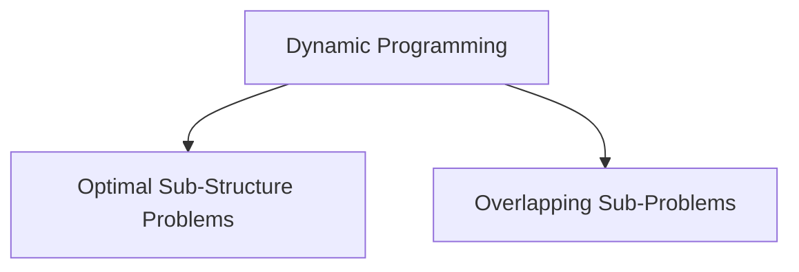
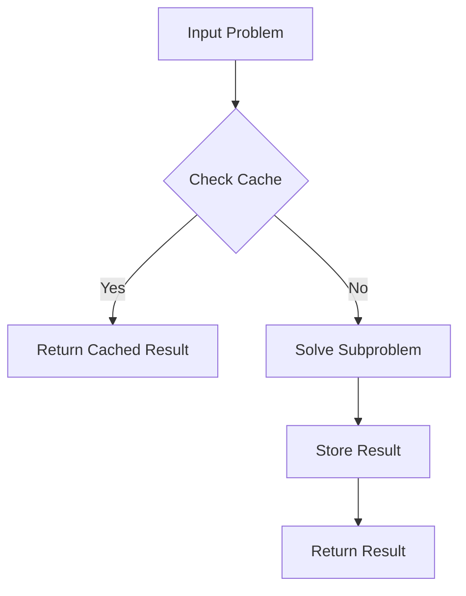
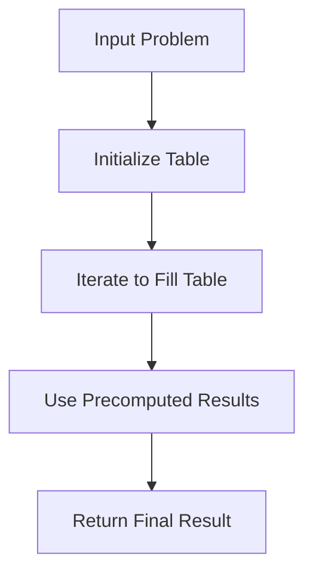

## Dynamic Programming
<div style="display: flex; justify-content: center;">
  
</div>

- Dynamic Programming (DP) solves problems by breaking them into overlapping subproblems and reusing solutions to subproblems.
- Two main techniques in DP are : **Memoization** and **Tabulation**.
- DP follows **Principle of Optimality** : A Problem can be solved by Sequence of Decision.

---
## When to use Dynamic Programming ?



#### What are Overlapping Sub-Problems and Optimal Sub-Structure Problems?
##### 1. Overlapping Sub-Problems 
- A problem has overlapping subproblems if it reuses the same subproblem multiple times.
- **Example: Fibonacci Numbers**
  - To calculate `fib(5)`, it computes:
    ```plaintext
    fib(5) -> fib(4) + fib(3)
    ```
  - Then `fib(4)` calls `fib(3)` again (already calculated earlier).
  - **Overlapping Subproblems:** `fib(3)` is calculated multiple times.

##### 2. Optimal Substructure Problems
- A problem has optimal substructure if its solution can be built using solutions of its subproblems.
- **Example: Shortest Path in a Graph**
  - Find the shortest path from node A to C.
    ```plaintext
    A → B → C (Cost: 4 + 3 = 7)
    A → D → C (Cost: 2 + 5 = 7)
    ```
  - **Observation:**
    - The shortest path from A to C can be computed using the shortest paths:
      ```plaintext
      From A to B → Cost = 4
      From B to C → Cost = 3
      ```
  - **Optimal Substructure Property:**
    - The shortest path from A to C depends on combining the shortest paths from intermediate nodes (A → B and B → C).
### Key Differences:
| Property                  | Overlapping Subproblems            | Optimal Substructure              |
|---------------------------|------------------------------------|-----------------------------------|
| Definition                | Same subproblems solved multiple times. | Solution can be built using subproblem solutions. |
| Example                   | Fibonacci numbers.                 | Shortest path, Knapsack, LCS.     |
| Approach                  | Solved using memoization.          | Solved using recursion or dynamic programming. |
| Use of Cache              | Required to avoid redundant computation. | Cache helps but isn't always mandatory. |

## **Memoization** (Top-Down Approach)
### **Definition:**
- Optimization technique used in programming.
- Stores results of expensive function calls.
- Reuses results when the same inputs occur again.
- Commonly applied in dynamic programming.
- Solves problems with overlapping subproblems and optimal substructure properties.

### **Key Concepts:**
- **Cache Results**: Stores previously computed results in a lookup table (cache).
- **Avoid Re-computation**: When the function is called with the same inputs, it returns the cached result instead of recalculating.
- **Improves Efficiency**: Converts exponential time complexity algorithms into polynomial time complexity.

### **Steps in Memoization:**


---

## **Tabulation** (Bottom-Up Approach)
### **Definition:**
- Finds the results of larger problems with the help of precomputed smaller problems.
- Tabulation builds solutions iteratively using a table.
- Avoids recursion by filling up entries starting from base cases.

### **Key Concepts:**
- **Iterative Approach**: Solves problems iteratively without recursion.
- **Table for Results**: Uses a table (array) to store solutions of subproblems.
- **Botton-Up Calculation** : Solves sub-problems from the smallest inputs & uses these to find larger problems.
- **Avoids Stack Overflow**: Since recursion is avoided, there is no risk of exceeding the recursion stack limit.
- **Efficiency**: Suitable for problems where the size of the solution space is small and can be computed step-by-step.

### **Steps in Tabulation:**


---

# Tabulation vs Memoization in Dynamic Programming


| **Aspect**                   | **Tabulation (Bottom-Up)**                                              | **Memoization (Top-Down)**                                           |
|------------------------------|------------------------------------------------------------------------|----------------------------------------------------------------------|
| **Approach**                 | Iterative (Bottom-Up)                                                  | Recursive (Top-Down)                                                 |
| **Computation Order**        | Solves all subproblems starting from the smallest (first entry).       | Solves only required subproblems (computed on demand).               |
| **Table Entries**            | Fills the entire table step-by-step, even if some values are unnecessary. | Fills only the required entries when needed during recursion.        |
| **Function Call Overhead**   | Avoids recursion, thus no function call overhead.                      | Incurs function call overhead due to recursion.                      |
| **Space Complexity**         | Requires explicit table storage but avoids recursion stack.            | Uses additional stack space due to recursion (can cause overflow).   |
| **Time Complexity**          | Better performance when all subproblems must be solved.                | Better when only a subset of subproblems need to be solved.          |
| **Ease of Implementation**   | Often easier for beginners as it avoids recursion.                     | Recursion can be more intuitive for some problems.                   |
| **Dependency Handling**      | Dependencies between subproblems are explicitly managed through loops. | Dependencies are implicitly handled by recursive calls.              |
| **Efficiency**               | Performs well when all subproblems need solutions.                     | Performs well when some subproblems can be skipped.                  |
| **Best Use Case**            | When the problem has a dense subproblem space (e.g., Fibonacci, LCS).  | When the problem has a sparse subproblem space (e.g., DFS-like problems). |


---

## **Applications:**
- Fibonacci Numbers
- Longest Common Subsequence
- 0/1 Knapsack Problem
- Coin Change Problem
- Matrix Chain Multiplication
- Shortest Path Problems

---

<div style="display: flex; justify-content: center;">
  
</div>

# Sparse vs Dense Subproblems in Dynamic Programming
## 1. Dense Subproblem Space (Best for Tabulation)
**Example**: Compute the 10th Fibonacci number\
Observation:
  - To calculate `F(10)`, it computes:
    ```plaintext
    we need all previous values (F(0), F(1), ..., F(9))
    ```
### Why Dense?
- All subproblems are required.
- We must calculate each Fibonacci number up to n to find the answer.
- Every subproblem ```(F(0) to F(10))``` must be solved to compute the final result.
- Tabulation is efficient here because we calculate all subproblems step-by-step.

## 2. Sparse Subproblem Space (Best for Memoization)
**Example**: Find if there's a path from the top-left to the bottom-right corner of a maze with obstacles\
Observation:
  - To calculate `path`, it computes:
    ```plaintext
    If we encounter an obstacle (X), we can skip unnecessary paths
    ```
### Why Sparse?
- Only some paths need exploration.
- If we encounter an obstacle (X), we can skip unnecessary paths.
- We skip unnecessary paths blocked by obstacles.
- Memoization is efficient here because it avoids solving paths we don't need.


| **Aspect**                   | **Dense (Tabulation)**                                              | **Sparse (Memoization)**                                           |
|------------------------------|------------------------------------------------------------------------|----------------------------------------------------------------------|
| **Problem Example**          | Fibonacci Numbers, Longest Common Subsequence (LCS).                  | Maze Pathfinding, DFS-like problems.                                |
| **Need to Solve All?**       | Yes, must compute all subproblems.                                    | No, can skip irrelevant subproblems.                                |
| **Efficiency**               | Faster for problems with dense dependencies.                          | Faster for problems with sparse dependencies.                        |
| **Preferred Approach**       | Tabulation (Bottom-Up).                                               | Memoization (Top-Down).                                              |


This document provides a comprehensive understanding of **Memoization** and **Tabulation** techniques along with flowchart visualizations for better clarity.
